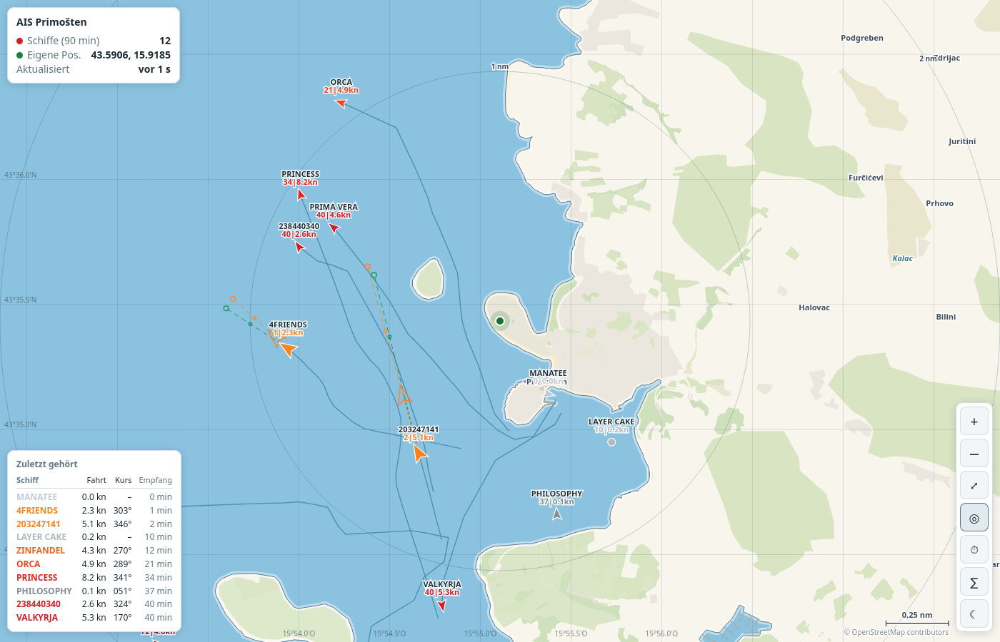

# AIS-Logger für BeagleBone Black

Liest AIS-Daten und die eigene GPS-Position vom Seanexx-USB-Stick und
speichert sie in einer lokalen SQLite-Datenbank (`data/aisdb.sqlite`).



*Live-Verkehr vor Primošten: zwölf Schiffe, neun davon in Fahrt. Die
Farbe nennt beides – Farbton die Fahrt, Helligkeit das Alter der Meldung.
Die zwei orangen, vergrößerten Ziele wurden vor ein und zwei Minuten
gehört und ziehen ihre gekoppelte Route für die nächsten sechs Minuten
hinter sich her (gestrichelt, mit Marken bei 3 und 6 min); grün derselbe
Pfad aus dem gemeldeten Kurs. Der grüne Punkt ist die eigene Position mit
dem 1-nm-Abstandsring, links unten die zuletzt gehörten Schiffe.*

Zum Übertragen des Projekts auf einen anderen Rechner (auch Windows/macOS)
siehe [PORTING.md](PORTING.md), zur Ersteinrichtung [INSTALL.md](INSTALL.md).

Der Code steht unter der [MIT-Lizenz](LICENSE). Die Kartendaten stammen aus
OpenStreetMap und stehen unter der ODbL – die Quellenangabe steht auf der
Karte selbst.

## Funktionsweise

1. `ais_logger.reader` (Dauerlauf) öffnet den seriellen Port des Sticks,
   erkennt Gerät und Baudrate automatisch (`ais_logger/serial_finder.py`).
   Für jede empfangene Zeile:
   - sie wird mit Zeitstempel-Tagblock roh in stündliche Archiv-Dateien
     unter `data/raw/*.nm4` geschrieben (Format kompatibel zum
     [aisdb](https://github.com/AISViz/AISdb)-Projekt, s. u.),
   - `!..VDM`/`!..VDO`-Sätze (AIS) werden sofort mit
     [pyais](https://github.com/M0r13n/pyais) decodiert (inkl. mehrteiliger
     Nachrichten wie Typ 5) und in die Tabelle `ais_messages` geschrieben.
     Gespeichert werden nur die Nachrichtentypen, die überhaupt eine Spalte
     füllen (1, 2, 3, 4, 5, 9, 11, 18, 19, 21, 24, 27) und die die
     Plausibilitätsprüfung bestehen – im Roharchiv bleibt alles erhalten.
     Die AIS-Kennwerte für „nicht verfügbar" (Breite 91, Länge 181, Fahrt
     102,3) werden als `NULL` abgelegt statt als Zahl: Breite 91 / Länge 181
     liest sich sonst als Position 4765 nm entfernt,
   - `$..GGA`/`$..RMC`/`$..GLL`-Sätze (GPS) werden als eigene Position in
     die Tabelle `own_position` geschrieben.
2. `ais_logger.ingest` ist ein optionales Backfill-Tool: es liest
   abgeschlossene `.nm4`-Archivdateien erneut ein (z. B. falls die DB mal
   zurückgesetzt wurde oder der Reader zwischenzeitlich down war, aber die
   Rohaufzeichnung weiterlief) und verschiebt sie nach `data/processed/`.

**Warum nicht `aisdb.decode_msgs` direkt?** Ursprünglich war geplant, das
Python-Paket `aisdb` (Dalhousie/AISViz) inkl. seines nativen Rust-Decoders
für die komplette Speicherung zu nutzen. Beim Testen hat sich gezeigt, dass
`aisdb.decode_msgs` in der installierten Version (1.7.2, PyPI-Wheel) **auch
mit den offiziellen, im Paket mitgelieferten Testdaten null Zeilen** in die
Zieltabelle schreibt (`error processing ..., skipping checksum`) – also ein
Problem im installierten Paket selbst, nicht in unserem Code. `pyais` (reines
Python, keine native Erweiterung) decodiert dieselben Nachrichten dagegen
zuverlässig und ist obendrein leichtgewichtiger für den BeagleBone (kein
Rust-Toolchain nötig). Das Rohlog-Format bleibt trotzdem aisdb-kompatibel,
falls ihr später die aisdb-Analysetools (Trajektorien etc.) nutzen wollt –
bitte `decode_msgs` dann selbst gegenprüfen, bevor ihr euch darauf verlasst.

Reader und Ingest laufen als getrennte Prozesse, damit ein langsamer
Nacharbeits-Lauf nie die Live-Aufnahme vom seriellen Port blockiert.

## Einrichtung auf dem BeagleBone Black

```bash
sudo apt-get update
sudo apt-get install -y python3-venv python3-dev
cd ~/bbb
python3 -m venv .venv
source .venv/bin/activate
pip install -r requirements.txt
```

Benutzer zur `dialout`-Gruppe hinzufügen (Zugriff auf `/dev/ttyUSB*`):

```bash
sudo usermod -aG dialout $USER
# neu einloggen, damit die Gruppe wirksam wird
```

Stick anschließen und Erkennung testen:

```bash
python -m ais_logger.serial_finder
```

Gibt Gerätepfad, Baudrate und ein paar Beispielzeilen aus. Falls die
Erkennung das falsche Gerät wählt oder nichts findet, Port/Baudrate fest
vorgeben:

```bash
export AIS_DEVICE=/dev/ttyUSB0
export AIS_BAUD=38400
```

## Dauerbetrieb per systemd

```bash
sudo cp systemd/ais-logger.service systemd/ais-ingest.service systemd/ais-ingest.timer /etc/systemd/system/
sudo systemctl daemon-reload
sudo systemctl enable --now ais-logger.service
sudo systemctl enable --now ais-ingest.timer   # optional, siehe oben
```

Pfade/User in den `.service`-Dateien (`WorkingDirectory`, `ExecStart`,
`User`) ggf. an den tatsächlichen Installationsort und Benutzernamen
anpassen. Logs: `journalctl -u ais-logger.service -f`.

## Karte

`webmap/` liefert eine Offline-Seekarte im Browser, auf der die empfangenen
Schiffe und die eigene Position live dargestellt werden:

```bash
cd ~/bbb && source .venv/bin/activate && python -m webmap.server
```

Dann im Browser `http://<beaglebone-ip>:8080/` öffnen. Ziehen verschiebt die
Karte, Mausrad bzw. Zwei-Finger-Geste zoomt, ein Klick auf ein Schiff zeigt
Name, MMSI, Position, Geschwindigkeit und Kurs. Aktualisierung alle 5
Sekunden.

Gezeichnet werden neben der Küstenlinie: Bodenbedeckung (Wald, Gestrüpp,
Obstplantagen …), Gewässer, Piers, **Fährrouten** als gestrichelte Linien
mit den Anlegern als Quadrat, **Verwaltungsgrenzen** (gestrichelt, violett),
Brücken sowie die Namen von Buchten und Kanälen in kursiver Wasserschrift.
Fährrouten sind hier mehr als Zierde: sie zeigen die planmäßigen
Verkehrswege, gegen die sich ein AIS-Ziel einordnen lässt.

Das kostet Startzeit. Auf dem BeagleBone dauert es dadurch **83 statt 13
Sekunden**, bis der Dienst antwortet (gemessen am 30.08.2026); allein die
Ebene `land` mit ihren 18 835 Flächen macht davon den Löwenanteil aus.
Neben dem Dekodieren fällt dabei auch das Serialisieren der 11 MB JSON ins
Gewicht. Wer den Start beschleunigen
will, nimmt sie in `webmap/tiles.py` als Erstes wieder heraus.

Die Küstenlinie wird als scharfe Kante gezeichnet, mit einem breiten,
weichen Saum davor – das liest sich als Flachwasserband und ist der
Unterschied zwischen einer Seekarte und einer Silhouette.

Sie kommt als **eigene Ebene** `coastline` vom Server, nicht aus dem Rand
der Ozean-Polygone. Vektorkacheln beschneiden jedes Polygon an ihrem
eigenen Rand; ein aus 1482 Kacheln zusammengesetztes Blatt trägt deshalb
eine gerade Kante entlang jeder Kachelgrenze. Wer den Polygonrand streicht,
zeichnet damit ein Netz im Kachelabstand über das Wasser – ein zweites
Koordinatengitter. `webmap/tiles.py` erkennt diese Schnittkanten daran,
dass sie achsparallel **und** außerhalb der Kachelfläche liegen (der
Beschnitt sitzt bei −64 und Kachelmaß + 64), und lässt sie weg. Ortsnamen ab
Stadtgröße stehen in Versalien, kleinere Orte in normaler Schreibweise.

Über dem Wasser liegt ein **Gradnetz**. Die Maschenweite folgt dem Zoom –
die feinste Normstufe (10° bis 10″), die noch mindestens 90 px Abstand
lässt. Beschriftet wird in Grad und Minuten, aber nur dort, wo keine
Bedienleiste darüberliegt.

Unten rechts steht ein **Maßstab in Seemeilen**. Er wählt die längste
gedruckte Normlänge (0,05 / 0,1 / 0,25 / 0,5 / 1 / 2 / 5 / 10 / 20 / 50 /
100 nm), die in 130 px passt, und rechnet die Breite an der Bildmitte ein –
ein Pixel ist weiter nördlich weniger Meter wert. Darunter steht die
Quellenangabe der Kartendaten – OpenStreetMap verlangt sie, und sie kam
bis 30.08.2026 nie an: `tiles.py` las den Metadatenschlüssel `author`
statt `attribution` und lieferte deshalb immer eine leere Zeichenkette.

Die Ausrichtung des Symbols folgt dem Steuerkurs, falls das Schiff einen
meldet, sonst dem Kurs über Grund. Meldet es keinen von beiden, wird ein
Kreis statt eines Pfeils gezeichnet. AIS kodiert „nicht verfügbar" dabei
als Zahlenwert (Steuerkurs 511, Kurs 360), was ungeprüft jedes
Klasse-B-Boot ohne Kompass nach Südost zeigen ließe.

Schiffe werden **nach Fahrt eingefärbt**: über 2 kn rot, alles darunter
grau. Die Schwelle trennt sauber, was hier tatsächlich vorkommt – Verkehr
im Kanal läuft 5–11 kn, während vor Anker liegende Boote unter 1 kn
bleiben. Unter der Kennung steht in einer zweiten Zeile
**`Minuten|Fahrt`**, etwa `4|6.5kn` – die Meldung ist vier Minuten alt, das
Schiff lief 6,5 kn. Beides in derselben Farbe wie der Rumpf.

Die Minutenzahl ist hier wichtiger als sie klingt: bei Kontaktzeiten von
wenigen Minuten und einem Sichtbarkeitsfenster von sechs Stunden sagt sie,
ob ein Ziel noch wirklich dort ist oder ob man nur die letzte Stelle sieht,
von der es gehört wurde.

Alter und Fahrt teilen sich die Farbe, ohne sich zu stören: der **Farbton**
trägt die Fahrt, die **Helligkeit** das Alter. Ein Schiff leuchtet in dem
Moment, in dem ein Paket ankommt, und dunkelt stufenlos nach, bis es aus
dem Anzeigefenster fällt.

Jede Fahrtklasse hat dafür eine eigene **mehrstufige Farbrampe**
(`rampMoving`, `rampSlow`) statt einer Farbe, die nach Grau verblasst. Die
warme läuft Orange → Rot → Karmin → Aubergine und trägt damit deutlich mehr
unterscheidbare Stufen als ein einzelner Farbton. Beide Rampen bleiben im
Farbton getrennt, damit die Fahrt ablesbar bleibt; innerhalb jeder fällt
die Luminanz **streng monoton**, damit das Alter ablesbar bleibt. Wer die
Farben ändert, sollte beides nachprüfen – `tools/webmaptest/test-rampe.js`
tut genau das. Bei einer Empfangsreichweite unter einer Seemeile
bedeutet ein Symbol „zuletzt gehört von", nicht „ist dort" – der Verlauf
macht auf einen Blick sichtbar, was sonst nur in der Beschriftung steht.

Zusätzlich werden Ziele um die Hälfte größer gezeichnet, die **beides**
sind:
innerhalb der letzten 6 Minuten gehört **und** über 2 kn in Fahrt. Bei einem
Fenster von 90 Minuten sammeln sich sonst viele alte Marken an, und die
aktuelle Lage geht darin unter. Das Fahrtkriterium ist dabei dasselbe wie
für die Farbe – was groß wird, ist auch rot. Ohne es würden ausgerechnet
die vor Anker liegenden Boote hervorstechen: die melden sich lückenlos und
sind deshalb immer „frisch", während der Durchgangsverkehr nach wenigen
Minuten wieder aus der Reichweite fällt.

Der Umriss bleibt dabei gleich dünn, und die Beschriftung rückt mit nach
oben.

### Gekoppelte Position

Zwischen zwei Meldungen fährt ein Schiff weiter – bei 8 kn eine Viertel
Seemeile in zwei Minuten, auf diesem Kartenausschnitt eine sichtbare
Strecke. Für Ziele in Fahrt zeichnet die Karte deshalb einen gestrichelten
Pfad in drei Teilen:

| | |
|---|---|
| Strichlinie vom Symbol weg | die seit der letzten Meldung gefahrene Strecke |
| **hohler Umriss** | wo das Schiff jetzt vermutlich ist |
| kleiner Kreis auf der Linie | wo es in **3 Minuten** sein wird |
| größerer Kreis am Ende | wo es in **6 Minuten** sein wird |

Alles gestrichelt und der Umriss hohl, weil nichts davon empfangene Daten
sind. Sechs Minuten sind bei 8 kn 0,8 nm – weit genug, um zu sehen, wohin
ein Schiff relativ zu den Inseln und zur Fahrrinne läuft. Die
Drei-Minuten-Marke gibt der Linie einen Maßstab, statt einen einzelnen
weit entfernten Endpunkt abschätzen zu lassen; ihr kleinerer Kreis liest
sich als die nähere und damit verlässlichere Aussage.

Die Marken stehen in `PREDICT_MARKS` – weitere Horizonte sind dort eine
Zeile.

Zusätzlich läuft **in Grün dieselbe Vorschau aus dem gemeldeten Kurs**
(COG) und der gemeldeten Fahrt. Der grüne Pfad hat Linie und Marken, aber
keinen Umriss – bei Übereinstimmung würden sonst zwei Rümpfe auf derselben
Stelle liegen.

Der Vergleich ist der eigentliche Nutzen: **decken sich beide Pfade, ist
das Bild verlässlich; laufen sie auseinander, hat das Schiff seit dem
vorletzten Fix gedreht oder die Fahrt geändert** – also genau der Moment,
in dem einer Vorhersage nicht zu trauen ist. Der grüne Pfad braucht keine
Spur und erscheint deshalb schon bei der **allerersten** Positionsmeldung
eines Schiffs – auch in derselben Sekunde, in der sie eintrifft. Die
gekoppelte Jetzt-Position fällt dann mit dem Fix zusammen, der Pfad nach
vorn ist trotzdem vollständig.

Die Geschwindigkeit dafür kommt aus dem **letzten Spursegment**, nicht aus
dem gemeldeten Kurs: der ist eine Momentaufnahme, das Segment ist das, was
das Schiff zwischen zwei Fixes tatsächlich getan hat. Drei Grenzen halten
die Rechnung ehrlich:

- höchstens **6 Minuten** nach der letzten Meldung – danach ist die
  Fortschreibung nicht mehr zu verantworten. Dieselbe Spanne, für die ein
  Ziel auch vergrößert gezeichnet wird: was als aktuell gilt, behält seinen
  Pfad,
- das Segment darf nicht länger als 10 Minuten zurückreichen, sonst
  beschreibt es die aktuelle Bewegung nicht mehr,
- nur für Schiffe über 2 kn – bei einem Ankerlieger ist das Segment
  GPS-Rauschen, und Fortschreiben würde eine Drift erfinden, die es nicht
  gibt.

Dafür tragen die Spurpunkte aus `/api/live` ihren Zeitstempel mit
(`[lon, lat, ts]`).

Die Spanne folgt dem Anzeigefenster, die Helligkeitsstufen verteilen sich
also immer über die tatsächlich sichtbaren Alter – auch in der Wiedergabe,
die mit 15 Minuten ein viel kürzeres Fenster hat. Das dunkelste Ende bleibt
bewusst vor der Hintergrundfarbe stehen, damit alte Ziele lesbar bleiben
statt sich aufzulösen.

Unten links steht eine Liste der **zehn zuletzt gehörten Schiffe** mit
Name (oder MMSI), Geschwindigkeit, Kurs und dem Alter der letzten Meldung
in Minuten. Der Kurs steht dreistellig in der seemännischen Schreibweise,
also `043°` statt `43°`. Bei einem Anzeigefenster von 90 Minuten liegen viele alte Marken
auf der Karte; die Liste beantwortet „was kam gerade durch", ohne dass man
das hellste Symbol suchen muss. Die Namen tragen dieselbe Farbe wie auf der
Karte. Ist ein Schiff angeklickt, rückt das Infofenster darüber – die
beiden teilen sich eine Spalte und überlagern sich nicht.

Die Schaltfläche ◎ blendet **Abstandsringe im 1-nm-Raster** um die eigene
Position ein (jeder fünfte Ring hervorgehoben), um Entfernungen zu Schiffen
und die tatsächliche Empfangsreichweite abzuschätzen. Sie brauchen einen
GPS-Fix und blenden sich beim Herauszoomen aus, sobald die Ringe dichter als
22 px stehen würden. Der Zustand wird wie die Tag-/Nachtansicht im Browser
gespeichert.

Gezeichnet werden nur die Ringe, die das Bild tatsächlich schneiden. Liegt
die eigene Position weit außerhalb des Kartenausschnitts – etwa ein alter
Fix vom vorigen Standort – erscheinen also keine Ringe um einen unsichtbaren
Mittelpunkt, sondern die passenden großen Ringe mitsamt Beschriftung
(„213 nm"). Das ist zugleich der schnellste Hinweis darauf, dass die
gespeicherte Eigenposition nicht stimmt.

### Statistik

Die Schaltfläche ∑ zeigt Rekorde über die gesamte Aufzeichnung: weiteste
Entfernung, längster Kontakt, größte Fahrt, meiste Meldungen, längster Weg
– jeweils mit Schiff und Zeitpunkt. Entfernungen werden gegen die **eigene
Position zum Zeitpunkt der Meldung** gerechnet, nicht gegen einen
Mittelwert; das Gerät ist schon einmal zwischen zwei Ländern umgezogen.

Meldungen mit mehr als **100 nm** Abstand fließen nicht ein und werden
unten im Fenster ausgewiesen. AIS ist UKW mit Sichtweite; 20–40 nm sind
normal, mit außergewöhnlicher Ausbreitung vielleicht 100. Was darüber
liegt, ist ein Decodierfehler und kein Schiff – am 31.08.2026 stand die
Bestmarke sonst bei 7507 nm.

### Wiedergabe der Aufzeichnung

Die Schaltfläche ⏱ spielt die letzten 24 Stunden im Zeitraffer ab,
**standardmäßig 60-fach** – eine Stunde Verkehr pro Minute. Das ist hier
kein Luxus: jedes Schiff ist nur ein bis fünf Minuten in Reichweite, und
zwischen den Kontakten liegen Stunden. In Echtzeit ist eine Aufzeichnung
schlicht nicht anschaubar.

Die Leiste am unteren Rand hat Abspielen/Pause, einen Umschalter für die
Geschwindigkeit (10× / 60× / 300× / 1800×), die Uhrzeit der Aufzeichnung
und einen Schieber zum Springen. `Leertaste` schaltet Pause, `Esc` beendet
die Wiedergabe und schaltet auf Live zurück.

Darunter stehen **alle in der Aufzeichnung gefundenen Schiffe**, durch `|`
getrennt – Name, falls einer empfangen wurde, sonst die MMSI. Die gerade
sichtbaren tragen dieselbe Farbe wie auf der Karte, also Farbton nach Fahrt
und Helligkeit nach Alter; die Liste ist damit zugleich die Legende zum
Kartenbild. Das Markup wird nur einmal aufgebaut und danach je Bild
umgefärbt – die Menge der Schiffe einer Aufzeichnung ändert sich ja nicht. Ein Klick auf einen Eintrag springt an die
erste Meldung dieses Schiffs und hält an; bei Kontakten von wenigen Minuten
in stundenlangen Aufzeichnungen findet man sie über den Schieber sonst
kaum.

Die Wiedergabe zeigt **nicht alle** aufgezeichneten Schiffe, sondern nur
die mit mindestens **6 Positionsmeldungen**, die irgendwann **über 2 kn**
liefen. Ein Ankerlieger meldet sich stundenlang und würde Liste und Karte
mit etwas füllen, das sich nie bewegt; eine Einzelmeldung ergibt ein
Symbol ohne Geschichte. Die Fahrtprüfung ist dieselbe wie für die Farbe –
was hier erscheint, wäre auf der Karte rot. Wie viele Schiffe die Auswahl
verworfen hat, steht rechts in der Leiste („… · 31 ausgeblendet"), damit
eine kurze Liste nicht wie ein schlechter Empfangstag aussieht.

Während der Wiedergabe bleiben Schiffe **15 Minuten aufgezeichneter Zeit**
sichtbar, nicht die sechs Stunden der Live-Ansicht – bei 60× wären das
sechs Minuten Wanduhr, und der Verkehrsfluss ginge unter. Ringe, Spuren und
Klick auf ein Schiff funktionieren wie sonst auch; die Live-Abfrage pausiert
solange.

Rechts oben steht eine **Tagesauswahl**, solange der Player offen ist:
`letzte 24 h` plus je eine Zeile pro aufgezeichnetem Tag mit der Zahl der
Meldungen, neuester zuerst. Ein Klick lädt diesen Tag; die gewählte
Geschwindigkeit bleibt dabei erhalten. Ein Tag umfasst 00:00 bis 24:00
UTC – dieselbe Zeitbasis, auf der auch alle Zeitstempel im Archiv liegen.

Die Daten kommen aus `/api/history?hours=N` (N zwischen 0,1 und 720) oder
`/api/history?date=JJJJ-MM-TT`; die Tagesliste selbst aus `/api/days`. Sie
werden am Stück geladen: bei den hier gemessenen Empfangsraten sind selbst
24 Stunden nur rund 9 KB gzip, dafür ist das Springen im Schieber sofort.

Tastatur: `+`/`-` zoomen, Pfeiltasten verschieben, `R` schaltet die Ringe,
`Leertaste` Wiedergabe-Pause, `Esc` schließt das Infofenster bzw. beendet
die Wiedergabe.

### Kartengrundlage

In Betrieb ist **`sibenik_archipel.mbtiles`** im Projektordner:
34,8 × 36,0 nm (15,40–16,20° O / 43,30–43,90° N), Zoom 0–14, 9,4 MB,
Vektorkacheln im Shortbread-Schema. Sie deckt den gesamten Inselgürtel und
die Stadt Šibenik ab, die im ursprünglichen 6-nm-Blatt fehlte.

Gesucht wird automatisch: zuerst im Projektordner, dann in `data/`; findet
sich dort nur ein ZIP-Archiv, wird die enthaltene `.mbtiles` einmalig nach
`data/map/` entpackt. Mit `AIS_MBTILES` lässt sich ein fester Pfad
vorgeben.

Die Karte liegt bewusst im **Projektordner** und nicht unter `data/`:
Letzteres ist in `.gitignore` und in den Übertragungsbefehlen ausgenommen,
eine Neuinstallation stünde sonst ohne Karte da.

**Selbst erzeugen** – mit [planetiler](https://github.com/onthegomap/planetiler)
und dem dort mitgelieferten Shortbread-Schema:

```bash
java -jar planetiler.jar generate-custom \
  --schema=samples/shortbread.yml --area=croatia --download \
  --bounds=15.40,43.30,16.20,43.90 --maxzoom=14 \
  --output=sibenik_archipel.mbtiles
```

Das Schema steckt im JAR unter `samples/shortbread.yml`
(`unzip planetiler.jar samples/shortbread.yml`). Planetiler lädt den
OSM-Auszug und die 886 MB Wasserpolygone selbst nach – Letztere sind
zwingend, denn die `ocean`-Ebene kommt nicht aus den OSM-Rohdaten. Der
Lauf braucht etwa 15 Minuten, davon das meiste Download; ein zweiter Lauf
mit anderem Ausschnitt dauert nur noch rund 2 Minuten.

Die fertige Datei in den Projektordner legen und `ais-map.service` neu
starten.

Bewusst ohne Kartenbibliothek gebaut: Der Server decodiert die Vektorkacheln
selbst (`webmap/mvt.py`) und schickt fertige Geometrie an den Browser, der
sie auf einem Canvas zeichnet. Dadurch braucht weder der BeagleBone
zusätzliche Pakete noch das anzeigende Gerät eine Internetverbindung.

## Kartenprüfungen

Der Zeichencode der Karte lässt sich ohne Browser prüfen: Canvas und DOM
werden durch Attrappen ersetzt, die jeden Aufruf mitschreiben.

```bash
python3 tools/webmaptest/fixtures.py     # Testdaten aus Karte und DB ziehen
node tools/webmaptest/run.js             # alle Suiten
node tools/webmaptest/run.js filter      # eine einzelne
```

Geprüft wird damit die **Mechanik** – Geometrie, Reihenfolge, Schwellen,
Formate –, nicht das Bild. Wie die Karte aussieht, sieht weiterhin nur ein
Mensch.

## Wiedergabe auf eine virtuelle Schnittstelle

`tools/replay_serial.py` spielt die aufgezeichneten Archive in Echtzeit auf
eine virtuelle serielle Schnittstelle. Damit lässt sich die ganze Kette –
Leser, Decoder, Datenbank, Karte – ohne angeschlossenen Empfänger betreiben.
Der Startzeitpunkt ist das Argument:

```bash
python3 tools/replay_serial.py --list                    # was liegt vor?
python3 tools/replay_serial.py 2026-08-29T06:00 --link /tmp/ttyAIS

# in einer zweiten Sitzung, gegen eine Wegwerf-Datenbank:
AIS_SET_CLOCK=0 AIS_DATA_DIR=/tmp/test AIS_DEVICE=/tmp/ttyAIS \
    python3 -m ais_logger.run_logger
```

Was am Port ankommt, ist vom echten Stick nicht zu unterscheiden: den
Tag-Block der Archive setzt `reader.py`, nicht die Hardware, deshalb wird er
wieder entfernt und der nackte NMEA-Satz mit CRLF geschrieben. Die Schnitt-
stelle ist ein Pty und hat keine echte Baudrate – das Tempo kommt aus den
Zeitstempeln.

**`AIS_SET_CLOCK=0` ist auf dem BeagleBone nicht optional.** Der Strom trägt
die GPS-Zeit der Aufzeichnung, und `gps_clock.py` glaubt ihm: ein Logger an
diesem Port würde die Systemuhr um Tage zurückstellen.

| Schalter | Wirkung |
|---|---|
| `--tempo N` | N-fache Geschwindigkeit, Vorgabe 1.0 |
| `--max-gap S` | Leerlauf über S Sekunden zusammenziehen, Vorgabe 60; `keep` gibt sie voll wieder |
| `--until T` | Endpunkt in der Aufzeichnung |
| `--link PFAD` | Symlink auf das Pty, damit der Port einen festen Namen hat |
| `--local` | Zeitangaben als Ortszeit lesen statt UTC |
| `--list` | zeigt Abdeckung, Lücken und Uhrversätze |

Die Vorgabe für `--max-gap` hat einen konkreten Grund: die Aufzeichnung hat
drei nächtliche Lücken von 8–9 Stunden, in denen die Wiedergabe sonst
einfach stillstünde.

Zwei Eigenheiten sind absichtlich so:

- **Der Leser muss mitkommen.** Auf dem BeagleBone sind Echtzeit rund 10
  Sätze/s und verlustfrei; bei `--tempo 20` waren es 154/s und über die
  Hälfte ging verloren. Ein Pty verhält sich hier wie eine echte Leitung –
  hört niemand zu, sind die Bytes weg. Verluste werden gezählt und am Ende
  gemeldet, nie verschwiegen.
- **Die Zeitstempel in der Datenbank sind die Wanduhr**, nicht die
  Aufnahmezeit – `reader.py` stempelt mit `time.time()`, genau wie am
  echten Stick. Eine Wiedergabe von vorgestern früh erscheint also als
  Verkehr von jetzt, was die Live-Karte gerade will. Wenn die
  Originalzeiten zählen, führt der Weg über die Archive oder den Web-Player.

Nachgeprüft: 90 Sekunden aus dem dichtesten Fenster (01.09., 06:39:30 UTC)
durch den unveränderten `run_logger` ergaben 9 von 9 Meldungen und 4 von 4
Schiffen, ohne Verlust und ohne Zusatz gegenüber dem Original.

## Daten abfragen

```python
import sqlite3
conn = sqlite3.connect("data/aisdb.sqlite")

conn.execute("SELECT * FROM ais_messages ORDER BY ts_unix DESC LIMIT 10").fetchall()
conn.execute("SELECT * FROM own_position ORDER BY ts_unix DESC LIMIT 10").fetchall()
```

`ais_messages`-Spalten: `ts_unix, mmsi, msg_type, lat, lon, sog_knots,
cog_deg, heading_deg, nav_status, shipname, callsign, source, raw`.
`own_position`-Spalten: `ts_unix, lat, lon, sog_knots, cog_deg,
source_sentence`.

## Konfiguration (Umgebungsvariablen)

| Variable | Standard | Zweck |
|---|---|---|
| `AIS_DATA_DIR` | `bbb/data` | Basisverzeichnis für Rohdaten + DB |
| `AIS_DB_PATH` | `<AIS_DATA_DIR>/aisdb.sqlite` | SQLite-Datei |
| `AIS_DEVICE` | (auto) | seriellen Port erzwingen |
| `AIS_BAUD` | (auto, testet 38400/4800/9600/115200) | Baudrate erzwingen |
| `AIS_ROTATE_MINUTES` | `60` | Rohlog-Rotationsintervall |
| `AIS_SOURCE_LABEL` | `SEANEXX` | Quell-Label in Tagblock/DB |
| `AIS_DEBUG` | (aus) | `1` gibt jede empfangene Rohzeile aus |
| `AIS_HEARTBEAT_SECONDS` | `10` | Statuszeile mit Zählern; `0` schaltet sie ab |
| `AIS_GPS_LOG_SECONDS` | `60` | Mindestabstand der `[gps]`-Meldungen |
| `AIS_POSITION_INTERVAL_SECONDS` | `30` | Mindestabstand gespeicherter Eigenpositionen |
| `AIS_RAW_RETENTION_DAYS` | `14` | Rohdaten-Archive älter als … löschen; `0` = nie |

In `systemd/ais-logger.service` steht `AIS_RAW_RETENTION_DAYS=0`: **auf
diesem Gerät wird nichts automatisch gelöscht.** Die Vorgabe von 14 Tagen
ist ein Schutz gegen vollaufende Platten im Dauerbetrieb; hier wird jeweils
nur rund eine Woche am Stück aufgezeichnet, und aufgezeichnetes Material
soll nicht hinter dem Rücken verschwinden. Zum Einordnen: rund 45 MB pro
Tag bei 11 GB frei – das reicht für etwa acht Monate ununterbrochenen
Lauf.
| `AIS_SET_CLOCK` | `1` | Systemuhr aus der GPS-Zeit stellen; `0` schaltet ab |
| `AIS_CLOCK_TOLERANCE_SECONDS` | `2` | ab welcher Abweichung die Uhr gestellt wird |

Nur für die Karte (`webmap.server`):

| Variable | Standard | Zweck |
|---|---|---|
| `AIS_WEB_HOST` | `0.0.0.0` | Bindeadresse; `127.0.0.1` beschränkt auf das Gerät |
| `AIS_WEB_PORT` | `8080` | Port |
| `AIS_MBTILES` | (automatisch) | fester Pfad zur Kartendatei |
| `AIS_SHIP_MAX_AGE_MINUTES` | `60` | wie lange ein Schiff nach der letzten Meldung sichtbar bleibt |
| `AIS_TRACK_MINUTES` | `30` | Länge der Spur hinter jedem Schiff |

In `systemd/ais-map.service` stehen beide Fenster auf **90 Minuten**
(`AIS_SHIP_MAX_AGE_MINUTES`, `AIS_TRACK_MINUTES`). Damit ist nichts auf der
Karte älter als anderthalb Stunden – weder ein Symbol noch eine Linie.

Die beiden bedeuten trotzdem Verschiedenes: das erste entscheidet, **wer**
gezeigt wird, das zweite, **wie viel** vom Weg eines gezeigten Schiffs.
Sind sie gleich groß, verliert ein Schiff kurz vor der Altersgrenze den
Anfang seiner Spur, bevor das Symbol selbst verschwindet. Wer die ganze
Anfahrt sehen will, setzt `AIS_TRACK_MINUTES` höher; Spuren von Schiffen
außerhalb des Anzeigefensters verwirft der Server ohnehin, Linien ohne
Schiff kann es also nicht geben. Die Karte schreibt
das eingestellte Fenster neben die
Schiffszahl, damit „0 Schiffe" nicht zwischen „nichts in Reichweite" und
„Fenster zu kurz" mehrdeutig bleibt. Länger als 10 Minuten stille Schiffe
werden gedämpft gezeichnet, frische und alte Ziele bleiben also
unterscheidbar.

Der Empfänger sendet einen RMC-Satz pro Sekunde. Ohne die beiden
Drosselungen wären das im Dauerbetrieb rund 86.000 Journal-Zeilen und
86.000 Datenbankzeilen pro Tag – unnötiger Verschleiß für den
eMMC-Speicher des BeagleBone.

## Uhrzeit

Der BeagleBone hat keine gepufferte Echtzeituhr, und am Beobachtungsort
gibt es keinen Weg ins Internet für NTP. Am 28.08.2026 ging die Systemuhr
deshalb **zwei Tage nach** – und damit auch jeder Zeitstempel in der
Datenbank und im Roharchiv.

Der Logger stellt die Uhr daher selbst aus der GPS-Zeit, die der Stick in
jedem RMC-Satz mitliefert (`ais_logger/gps_clock.py`). Bewusst systemweit
und nicht nur für die Datenbankspalten: Journal, stündliche Rotation des
Roharchivs und die Altersberechnung der Karte lesen alle die Systemuhr,
und eine nur teilweise korrigierte Zeit wäre schlimmer als eine
durchgehend falsche.

Das Stellen der Uhr braucht `CAP_SYS_TIME`. Die mitgelieferte
`ais-logger.service` erteilt genau dieses eine Recht, der Dienst läuft
weiterhin als unprivilegierter Benutzer:

```ini
AmbientCapabilities=CAP_SYS_TIME
CapabilityBoundingSet=CAP_SYS_TIME
```

**Nach einem Update der Unit-Datei nicht vergessen**, sie neu zu
installieren – sonst fehlt das Recht und im Journal steht einmalig eine
Warnung, dass die Uhr nicht gestellt werden konnte:

```bash
sudo cp systemd/ais-logger.service /etc/systemd/system/
sudo systemctl daemon-reload && sudo systemctl restart ais-logger.service
```

Im Journal sieht eine Korrektur so aus:

```
[clock] stepped system clock by +177492.3s to 2026-08-28T12:09:45+00:00 (GPS)
```

Ohne die Berechtigung, auf anderen Betriebssystemen oder mit
`AIS_SET_CLOCK=0` läuft alles unverändert weiter – nur eben mit der Uhr
des Rechners.

## Was ich getestet habe

Ohne echte BBB-/Stick-Hardware konnte ich nur die Software-Logik prüfen,
nicht den echten seriellen Betrieb. Verifiziert (lokal, mit den offiziellen
aisdb-Testdaten sowie handgebauten Beispielsätzen):

- Tagblock-Checksumme stimmt exakt mit dem dokumentierten aisdb-Beispiel
  überein.
- `ais_logger.ingest` decodiert die realen aisdb-Testdaten (979 Nachrichten,
  843 unterschiedliche MMSIs) korrekt in `ais_messages`, inklusive
  mehrteiliger Typ-5-Nachrichten (Schiffsname/Rufzeichen über 2 Sätze
  hinweg korrekt zusammengesetzt).
- GPS-Sätze (GGA/RMC) werden korrekt zu `own_position`-Einträgen mit
  Lat/Lon/SOG/COG geparst.
- Gemischter Stream aus AIS- und GPS-Zeilen wird im Reader-Codepfad korrekt
  in die jeweils richtige Tabelle geroutet.

**Nicht getestet:** echte serielle Kommunikation mit dem Seanexx-Stick,
Verhalten bei Stick-Neuverbindung/Wackelkontakt, Verhalten auf echtem
armv7l-Debian des BBB. Bitte vor Dauerbetrieb `python -m
ais_logger.serial_finder` und einen kurzen `run_logger`-Testlauf mit
echtem Stick machen.

## Bekannte Einschränkungen

- Die Geräteerkennung basiert auf Heuristik (Beschreibungstext + NMEA-
  Checksummen-Test), da keine USB-VID:PID für den Seanexx-Stick bekannt
  ist. Für eine stabile `/dev`-Zuordnung empfiehlt sich später eine
  udev-Regel (`udevadm info -a -n /dev/ttyUSB0` nach Anschluss prüfen).
